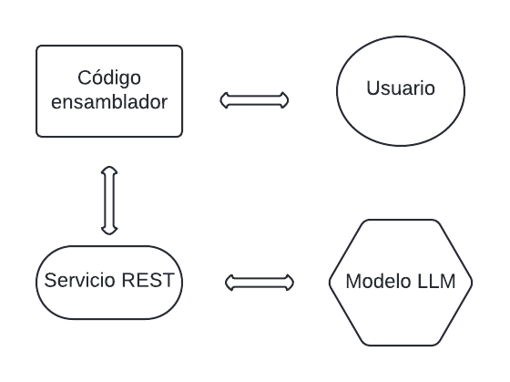

# DeepASM-Explainer: Compilation and analysis of instructions
Este proyecto implementa estrategias de compilación para lenguaje ensamblador utilizando modelos LLM para la detección y sugerencia de errores en el código. Esta enfocado para el analisis de instrucciones en ensamblador RV32IMFD para proporcionar una retroalimentación sobre errores sintácticos al compilar mediante una integracion de un servicio REST.

## Tabla de Contenido

- [Estructura del Proyecto](#estructura-del-proyecto)
- [Requisitos](#requisitos)
- [Instalación](#instalación)
- [Uso](#uso)
  - [Ejecución Local](#ejecución-local)
  - [Uso del Servicio REST](#uso-del-servicio-rest)
- [Ejemplo](#ejemplo)
- [Conclusión](#conclusión)


## Estructura del Proyecto

- **main.py**: Archivo principal que ejecuta el compilador.
- **lexical.py**: Analizador léxico que tokeniza el código ensamblador.
- **sintacticals.py**: Analizador sintáctico que valida la estructura del código ensamblador.
- **datatypes.py**: Define los tipos de datos utilizados durante el análisis.
- **directives.py**: Directivas específicas de la arquitectura RISC-V.
- **servicio_rest.py**: Servicio REST que permite la integración del modelo T5 con el compilador.
- **T5_model/**: Carpeta que contiene el modelo T5 entrenado para la sugerencias de instrucciones.
- **text.s**: Ejemplo de código ensamblador utilizado para pruebas.



## Requisitos

- Python 3.8 o superior
- Bibliotecas necesarias, guardar en un .txt con el nombre `requirements.txt`:
  - `transformers`
  - `torch`
  - `flask`


**Instalación de requerimientos:**
   ```bash
   pip install -r requirements.txt
   ```
  
## Instalación

1. **Clonar el repositorio:**
   ```bash
   git clone https://github.com/MASE98/DeepASM-Explainer.git
   ```
   ```bash
   cd ASMCompiler
   
2. **Utilizar el modelo entrendo en T5_model:**
   ```bash
   cd T5_model

## USO

### Ejecución Local

- Se comienza iniciando el servicio REST:

   ```bash
   python3 servicio_rest.py
   ```

- Luego se ejecuta el sistema localmente proporcionando un archivo ensamblador como entrada.

   ```bash
   python3 main.py text.s

Esta ejecucion dara una respuesta que incluirá un análisis del código y una sugerencia en caso de detectar un error.

## Ejemplo
Como ejemplo de lenguaje ensamblador tenemos una suma de dos valores que utiliza conjunto de instrucciones RISC-V:

    ```bash
    .text
    main:

        li t0, 5
        li t1, 13

        add t4, t0, t1  # t4 = 5+13
        
        mv a0, t4
        li a7, 1
        ecall
    
        # return 
        jr ra
    ```
     
- El fichero que contenga el programa en lenguaje ensamblador y utilizando los comando expuesto en la ejecución local
- Se obtendria un resultado donde se exprese la composición para el análisis y las sugerencias en caso de presentarse un error:

    ```bash
    [{'error': None,
    'labels_asm': {'main': 0},
    'obj': [{'assembly_reference': None,
            'assembly_reference_index': -1,
            'associated_context': {'line': 4, 'newlines': [9, 19, 20], 't': 31},
            'binary': '',
            'byte_size': 4,
            'comments': [],
            'datatype': 'pseudoinstruction',
            'endian': 'little',
            'format': '',
            'labels': ['main'],
            'pending': [],
            'seg_name': '.text',
            'track_source': [],
            'value': {'fields': ['li', 'li'],
                        'instruction': 'li',
                        'signature_size_arr': [0],
                        'signature_type_arr': ['li']}},
            {'assembly_reference': None,
            'assembly_reference_index': -1,
            'associated_context': {'line': 5,
                                    'newlines': [9, 19, 20, 37],
                                    't': 48},

- Salida del servicio_REST con las sugerencias con la ayuda del modello LLM (T5):
```bash
Verificando instrucción en línea 2: add rd rs1,
 La instrucción 'add rd rs1,' es incorrecta.
 Se sugiere: 'add rd rs1, rs2'

Verificando instrucción en línea 3: li  rd imm
```
## Conclusión

Es una herramienta para la detección y corrección de errores en código ensamblador proporcionando una solución que esta integrada con un modelo LLM como T5 para mejorar la precisión en el análisis de código con el servicio REST.